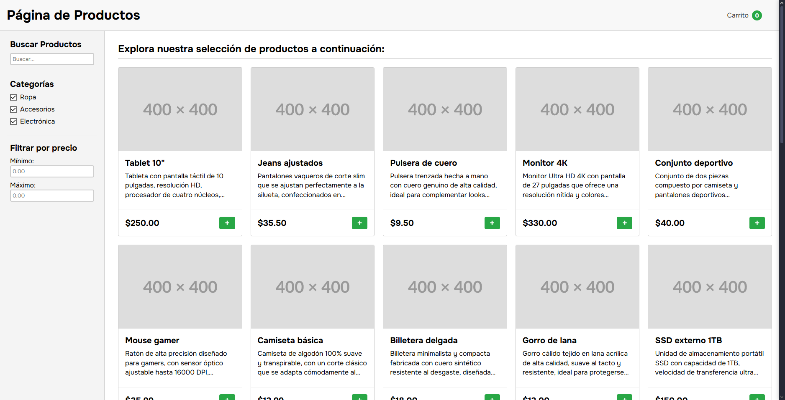

# 🛍️ Página de Productos

Una página de productos completa con carrito de compras y sistema de filtrado desarrollada con HTML, CSS y JavaScript vanilla. Este es el **Proyecto #9** de mi serie de proyectos de desarrollo web.

## 📋 Descripción

Aplicación web de e-commerce que simula una tienda online con funcionalidades completas de navegación, filtrado de productos, carrito de compras y proceso de compra. Incluye persistencia de datos, modales interactivos y una interfaz responsive moderna.

## ✨ Características Implementadas

- **Catálogo de productos:** 20+ productos con imágenes, descripciones y precios
- **Sistema de filtrado:** Búsqueda por texto, categorías y rango de precios
- **Carrito de compras:** Agregar, modificar cantidades y eliminar productos
- **Persistencia con localStorage:** Carrito guardado entre sesiones
- **Modal de detalles:** Vista expandida de productos con formulario
- **Sidebar del carrito:** Panel lateral con resumen de compras
- **Proceso de compra:** Finalización con resumen y confirmación
- **Feedback visual:** Animaciones de burbujas al agregar productos
- **Validación de filtros:** Prevención de rangos de precios inválidos
- **Responsive design:** Interfaz adaptable a dispositivos móviles

## 🛒 Funcionalidades del E-commerce

### Navegación y Filtros

- **Búsqueda en tiempo real** por nombre de producto
- **Filtros por categoría** (Ropa, Accesorios, Electrónica)
- **Filtros por precio** con validación de rangos
- **Combinación de filtros** múltiples simultáneos

### Gestión de Productos

- **Vista de tarjeta** con imagen, título y precio
- **Modal de detalles** con descripción completa
- **Botón de agregar rápido** (+) en cada producto
- **Selector de cantidad** en modal de detalles

### Carrito de Compras

- **Contador en header** con cantidad total de productos
- **Sidebar deslizable** con lista de productos
- **Modificación de cantidades** directamente en el carrito
- **Eliminación de productos** individual
- **Cálculo automático** del total
- **Persistencia** con localStorage

## 🛠️ Tecnologías Utilizadas

- **HTML5:** Estructura semántica moderna con:
  - Dialog elements nativos para modales
  - Formularios accesibles con labels
  - Estructura semantic (header, main, aside, section)
  - Meta tags optimizados
- **CSS3:** Estilos avanzados con:
  - CSS Nesting moderno
  - Flexbox y CSS Grid para layouts
  - Sticky positioning para sidebar
  - Keyframes para animaciones
  - Custom properties para consistencia
  - Media queries responsivas
- **JavaScript ES6+:** Lógica avanzada con:
  - Módulos ES6 (import/export)
  - Classes y objetos para organización
  - Event delegation y listeners
  - localStorage API
  - Array methods (filter, find, map)
  - Template literals para HTML dinámico
  - State management centralizado
- **Datos estructurados:** Archivo de productos en módulo separado
- **Google Fonts:** Tipografía Onest (100-900 weights)
- **Placeholder API:** Imágenes de productos via placehold.co

## 🎨 Diseño y Estilo

### Paleta de Colores

```css
/* Tema limpio y comercial */
--bg-primary: #ffffff; /* Fondo principal */
--bg-secondary: #f8f8f8; /* Fondo del header */
--bg-sidebar: #f4f4f4; /* Fondo del sidebar */
--text-primary: #333333; /* Texto principal */
--accent-primary: #28a745; /* Verde principal */
--accent-hover: #218838; /* Verde hover */
--border: #cccccc; /* Bordes */
--shadow: rgba(0, 0, 0, 0.1); /* Sombras suaves */
--error: #dc3545; /* Rojo para errores */
```

### Efectos Especiales

- **Header fijo** con z-index elevado
- **Sidebar sticky** con scroll independiente
- **Animaciones de burbujas** al agregar productos
- **Transiciones suaves** en hover y focus
- **Modal con backdrop** nativo del navegador
- **Grid responsive** para productos

## 📱 Diseño Responsivo

### Características

- **Layout flexible:** Sidebar colapsable en móviles
- **Grid adaptativo:** Productos ajustables según pantalla
- **Header responsive:** Navegación optimizada para touch
- **Modal responsive:** Tamaños adaptativos para modales

## 📦 Productos Disponibles

### Categorías

- **Electrónica:** Tablets, monitores, mouses, teclados, auriculares
- **Ropa:** Jeans, conjuntos deportivos, camisetas, chaquetas
- **Accesorios:** Pulseras, relojes, gorras, bolsos

### Datos de Ejemplo

```javascript
{
  id: 1,
  title: 'Tablet 10"',
  image: "https://placehold.co/400",
  description: "Tableta con pantalla táctil de 10 pulgadas...",
  price: 250.0,
  category: "electronics",
}
```

## 📂 Estructura del Proyecto

```
09-products-page/
├── index.html              # Página principal
├── styles.css              # Estilos CSS
├── script.js               # Lógica JavaScript
├── data/                   # Datos de productos
│   └── products.js         # Catálogo de productos
├── screenshots/            # Capturas de pantalla
│   └── app-view.png        # Vista de la aplicación
└── README.md              # Documentación
```

## 🚀 Instalación y Uso

### Clonar el repositorio

```bash
git clone https://github.com/Zero-Fhx/09-products-page.git
cd 09-products-page
```

### Ejecutar el proyecto

1. **Método simple:** Abre `index.html` directamente en tu navegador
2. **Con Live Server (recomendado):**
   - Instala Live Server en VS Code
   - Click derecho en `index.html` → "Open with Live Server"
3. **Servidor local:**

   ```bash
   # Con Python 3
   python -m http.server 8000

   # Con Node.js (http-server)
   npx http-server
   ```

## ✅ Requisitos Cumplidos

Este proyecto incluye todas las características esenciales de una página de productos:

- [x] Catálogo de productos con imágenes y precios
- [x] Sistema de filtrado por categorías y precio
- [x] Búsqueda de productos en tiempo real
- [x] Carrito de compras funcional
- [x] Persistencia de datos con localStorage
- [x] Modal de detalles de productos
- [x] Proceso de compra completo
- [x] Interfaz responsive y moderna

## 🌐 Demo en Vivo

🔗 **[Ver Demo](https://zero-fhx.github.io/09-products-page/)** (GitHub Pages)

## 📸 Captura de Pantalla



## 🔧 Características Técnicas Destacadas

### State Management Centralizado

```javascript
const state = {
  filter: {
    search: "",
    categories: [],
    price: {
      min: 0,
      max: Infinity,
    },
  },
  cart: [],
  actualProduct: null,
};
```

### Sistema de Filtrado Avanzado

```javascript
const FilterManager = {
  handleCategoryChange(e) {
    const category = e.target.dataset.category;

    if (e.target.checked) {
      if (!state.filter.categories.includes(category)) {
        state.filter.categories.push(category);
      }
    } else {
      const remainingCategories = state.filter.categories.filter(
        (cat) => cat !== category
      );

      if (remainingCategories.length === 0) {
        e.target.checked = true;
        return;
      }

      state.filter.categories = remainingCategories;
    }
    ProductManager.filterProducts();
  },

  handlePriceChange(e) {
    const key = e.target.id === "min-price" ? "min" : "max";
    const value = parseFloat(e.target.value);
    const currentValue = isNaN(value) ? (key === "min" ? 0 : Infinity) : value;

    state.filter.price[key] = currentValue;
    ProductManager.filterProducts();
  },
};
```

### Gestión del Carrito con Persistencia

```javascript
const CartManager = {
  addToCart(productId, quantity = 1) {
    const product = products.find((p) => p.id === productId);
    const cartItemExists = state.cart.find((item) => item.id === productId);

    if (cartItemExists) {
      cartItemExists.quantity += quantity;
    } else {
      state.cart.push({
        id: product.id,
        price: product.price,
        quantity: quantity,
      });
    }

    this.saveToLocalStorage();
    this.updateCartDisplay();
  },

  saveToLocalStorage() {
    localStorage.setItem("cart", JSON.stringify(state.cart));
  },

  loadFromLocalStorage() {
    const savedCart = localStorage.getItem("cart");
    if (savedCart) {
      state.cart = JSON.parse(savedCart);
    }
  },
};
```

### Feedback Visual con Animaciones

```javascript
const UI = {
  createBubbleFeedback(text, button) {
    const bubble = document.createElement("span");
    bubble.classList.add("bubble-feedback");
    bubble.textContent = text;

    button.style.position = "relative";
    button.appendChild(bubble);

    bubble.addEventListener("animationend", () => {
      bubble.remove();
    });
  },
};
```

### Creación Dinámica de Productos

```javascript
const ProductManager = {
  createProductElement(product) {
    const productElement = document.createElement("article");
    productElement.classList.add("product");
    productElement.setAttribute("data-id", product.id);
    productElement.innerHTML = `
      
      <div class="product-info">
        <h2 class="product-title">${product.title}</h2>
        <p>${product.description}</p>
      </div>
      <footer class="product-actions">
        <span class="price">$${product.price.toFixed(2)}</span>
        <button class="add-to-cart">+</button>
      </footer>
    `;

    this.attachProductEvents(productElement, product);
    return productElement;
  },
};
```

### Validación de Filtros de Precio

```javascript
validatePriceInputs() {
  const minInput = document.getElementById("min-price");
  const maxInput = document.getElementById("max-price");
  const minValue = parseFloat(minInput.value);
  const maxValue = parseFloat(maxInput.value);

  minInput.classList.remove("price-error");
  maxInput.classList.remove("price-error");

  if (!isNaN(minValue) && !isNaN(maxValue) && minValue > maxValue) {
    minInput.classList.add("price-error");
    maxInput.classList.add("price-error");
    return false;
  }

  return true;
}
```

## 🛒 Funcionalidades del E-commerce

### Flujo de Compra

1. **Navegación:** Usuario explora productos con filtros
2. **Selección:** Click en producto abre modal con detalles
3. **Agregar al carrito:** Selección de cantidad y confirmación
4. **Gestión del carrito:** Modificación en sidebar lateral
5. **Finalización:** Proceso de checkout con resumen
6. **Confirmación:** Modal de compra exitosa

### Características del Carrito

- **Persistencia:** Mantiene productos entre sesiones
- **Contador visual:** Badge en header con cantidad total
- **Gestión completa:** Agregar, modificar, eliminar productos
- **Cálculo automático:** Total actualizado en tiempo real
- **Sidebar deslizable:** Panel lateral no invasivo

### Sistema de Filtros

- **Texto libre:** Búsqueda por nombre de producto
- **Categorías múltiples:** Selección de una o más categorías
- **Rango de precios:** Mínimo y máximo con validación
- **Combinación inteligente:** Todos los filtros funcionan juntos

## 🔮 Futuras Mejoras

- [ ] **Wishlist/Favoritos** para guardar productos deseados
- [ ] **Comparador de productos** lado a lado
- [ ] **Reseñas y calificaciones** de usuarios
- [ ] **Galería de imágenes** múltiples por producto
- [ ] **Filtros avanzados** (marca, color, tamaño)
- [ ] **Ordenamiento** (precio, popularidad, calificación)
- [ ] **Paginación** para catálogos grandes
- [ ] **Descuentos y cupones** aplicables
- [ ] **Historial de compras** del usuario
- [ ] **Recomendaciones** basadas en compras

## 📝 Lecciones Aprendidas

### Arquitectura de Aplicación

- **Modular organization** con managers especializados
- **State management** centralizado para datos compartidos
- **Separation of concerns** entre UI, lógica y datos
- **Event delegation** eficiente para elementos dinámicos

### E-commerce Patterns

- **Shopping cart patterns** con persistencia
- **Product filtering** con múltiples criterios
- **Modal workflows** para detalles de productos
- **Feedback systems** para acciones de usuario

### JavaScript Avanzado

- **ES6 modules** para organización de código
- **Array methods** para manipulación de datos
- **LocalStorage** para persistencia del lado cliente
- **Template literals** para generación de HTML

### UX/UI Design

- **Progressive enhancement** sin dependencias externas
- **Responsive patterns** para múltiples dispositivos
- **Visual feedback** inmediato en todas las acciones
- **Accessibility** con estructura semántica y ARIA

### Performance Optimization

- **Efficient DOM manipulation** con fragmentos
- **Event delegation** para elementos dinámicos
- **Lazy loading** concepts para imágenes
- **State updates** optimizados para renderizado

## 🤝 Contribuciones

Este es un proyecto personal de aprendizaje, pero si encuentras mejoras o tienes sugerencias:

1. Fork el repositorio
2. Crea una rama para tu feature (`git checkout -b feature/mejora`)
3. Commit tus cambios (`git commit -m 'Añadir mejora'`)
4. Push a la rama (`git push origin feature/mejora`)
5. Abre un Pull Request

## 👨‍💻 Autor

**Erick Obed Flores Ricra**

- 🐙 GitHub: [@Zero-Fhx](https://github.com/Zero-Fhx)
- 💼 LinkedIn: [Erick Obed Flores Ricra](https://www.linkedin.com/in/erick-obed-flores-ricra-14a121280)
- 📧 Email: erickflores170404@gmail.com

---

**🤖 Desarrollo Asistido por IA:** Este proyecto fue desarrollado con la asistencia de inteligencia artificial para la búsqueda de información, resolución de problemas técnicos, optimización de código, consulta de conceptos desconocidos y creación de esta documentación.
